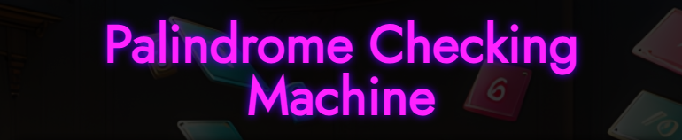

 

### _**A palindrome is a word or sentence that's spelled the same way both forward and backward, ignoring punctuation, upper/lower case, and spacing.**_

**Try to trick the Machine, enter exclamations, questions, quotes, hyphens, spaces... If there is a palindrome, it will found it ‼**

 

🟪 **Visit:** [Palindrome Checker ↗](https://conancos.dev/next/logica-js/PalindromeCheckingMachine/index.html) 🟪

